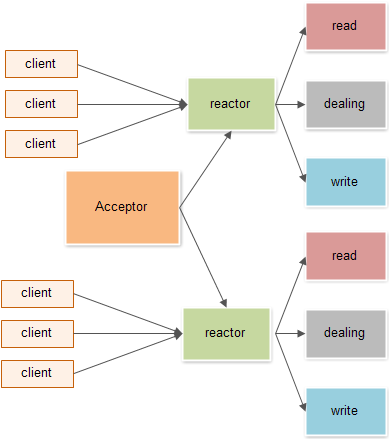

# net-reactor
it's a simple and easy net framework with nio mode written by java

# reactor model


# how-to
## just simply like:
```
public class MyHandler implements Handler {

	private static final Logger LOGGER = LoggerFactory.getLogger(MyHandler.class);
	private long readSize;

	/**
	 * The logic to deal with the received data.
	 *  
	 * It means that reactor will trigger this function once the data is received.
	 * @throws IOException 
	 */
	public void handle(FrontendConnection connection) throws IOException {
		Buffer buff = connection.getReadBuffer();
		readSize = +readSize + buff.position();
		LOGGER.info(connection.getId() + " connection has receive " + readSize);

	}

}
```
```
Handler handler = new MyHandler();
ReactorPool reactorPool = new ReactorPool(Runtime.getRuntime().availableProcessors(), handler);
new Acceptor(reactorPool, acceptorName, host, port).start();
```

## adding a connection event or a connection multi-event:
```
public class RegisterHandler implements ConnectionEventHandler {
	private static final Logger LOGGER = LoggerFactory
			.getLogger(RegisterHandler.class);

    private static int INTERESTED = ConnectionEvents.REGISTE;

	public void event(FrontendConnection connection) {
	    if ((event & INTERESTED) != 0) {
	        //do something here	
	    }
	}

}

```
```
Handler handler = new NetHandler();
ConnectionEventHandler connectionEventHandler = new RegisterHandler();
ReactorPool reactorPool = new ReactorPool(Runtime.getRuntime().availableProcessors(), handler);
Acceptor acceptor = new Acceptor(reactorPool, acceptorName, host, port);
acceptor.addConnectionEventHandler(connectionEventHandler);
acceptor.start();
```
```
public class ConnectionLogHandler implements ConnectionEventHandler {
	private static final Logger LOGGER = LoggerFactory
			.getLogger(ConnectionLogHandler.class);
	private static int INTERESTED = ConnectionEvents.ACCEPT
			| ConnectionEvents.CLOSE;

	public void event(Connection connection, int event) {
		if ((event & INTERESTED) != 0) {
			if ((event & ConnectionEvents.ACCEPT) != 0)
				LOGGER.info("accept connection,id is " + connection.getId());
			if ((event & ConnectionEvents.CLOSE) != 0)
				LOGGER.info("close connection,id is " + connection.getId());
		}
	}
}

```


## implements the connection
```
public class XXXConnection extends Connection {

	private String name;

	public XXXConnection(SocketChannel channel, long id, Reactor reactor) {
		super(channel, id, reactor);
	}

	public String getName() {
		return name;
	}

	public void setName(String name) {
		this.name = name;
	}

}
```
```
public class XXXConnectionFactory implements ConnectionFactory {

	public XXXConnection createConnection(SocketChannel channel, long id,
			Reactor reactor) {
		return new XXXConnection(channel, id, reactor);
	}

}
```
```
Acceptor acceptor = new Acceptor(reactorPool, acceptorName, host,port);
acceptor.setConnectionFactory(new xxxConnectionFactory());
```

